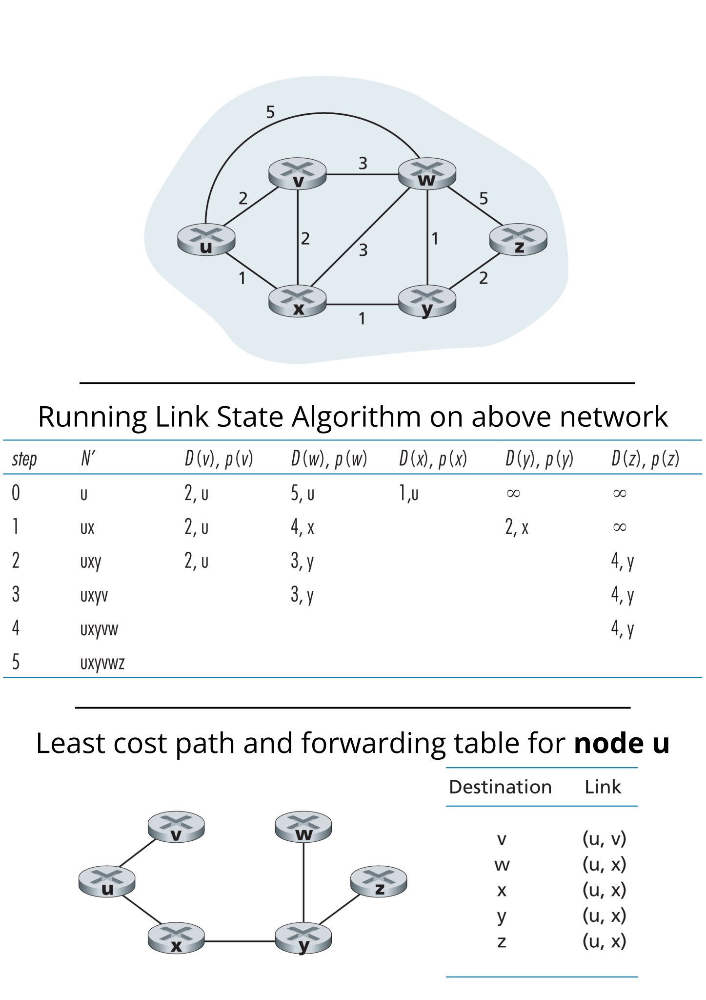

## **Introduction**  
- Link-State Routing is a **dynamic routing algorithm** that provides each node with a **complete view of the network topology**.  
- It uses **link-state packets (LSPs)** to share information about directly connected neighbors and link costs.  
- Each node independently computes the shortest path to all destinations using the **Dijkstra algorithm**.  

## **Link-State Packet (LSP) and Network View**  
- Each node broadcasts **Link-State Packets** containing:  
  - Its **own identity**.  
  - The **cost** of links to directly connected neighbors.  
- The **link-state broadcast algorithm** ensures that all nodes receive identical LSPs, leading to a **consistent view** of the network.  

## **Shortest Path Calculation**  
- Each node runs the **Link-State (LS) algorithm** to compute the shortest path from itself to all other nodes.  
- The key update step in the algorithm is:  

  **D(v) = min{D(v), D(w) + c(w,v)}**

  where:  
  - **D(v):** Cost of the least-cost path from the source to destination **v** at this iteration.  
  - **D(w):** Cost of the least-cost path from the source to node **w**.  
  - **c(w,v):** Cost of the link between **w** and **v**.  

## **Forwarding Table Construction**  
- After running the algorithm, each node determines:  
  - The **predecessor node** along the least-cost path to each destination.  
  - Using this information, a **forwarding table** is created, mapping each destination to its **next-hop** node.  

## Example (from *Computer Networking: A Top-Down Approach* - Chapter 5)

### Reference Books
1. Kurose, J. F., & Ross, K. W. *Computer Networking: A Top-Down Approach*. Pearson.
2. Tanenbaum, A. S., & Wetherall, D. J. *Computer Networks*. Pearson.